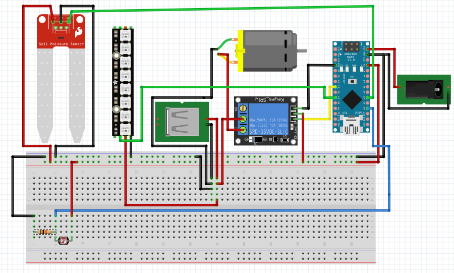

# garden-automation
Arduino ile toprak kuruduğunda otomatik sulama ve hava karardığında otomatik aydınlatma sistemi

# Malzemeler

**1.** Arduino Nano
 
**2.** Toprak nem sensorü

**3.** 5v röle modülü

**4.** Neopixel 8'li şerit led

**5.** Mini dalgıç pompa

**6.** Ldr

**7.** 10K direnç

**8.** 9/12v adaptör (arduino'yu beslemek için)

**9.** 5v adaptör (dalgıç pompayı ve neopixel'i beslemek için)

**10.** Dc barrel jack

**11.** Usb kablosu

# Bağlantılar

# Kodlar

[***Kodlar için tıkla***](https://github.com/technomonkey-7/garden-automation/blob/master/files/garden-automation.ino)

Licensed under the [MIT License](https://github.com/technomonkey-7/garden-automation/blob/master/LICENSE).
